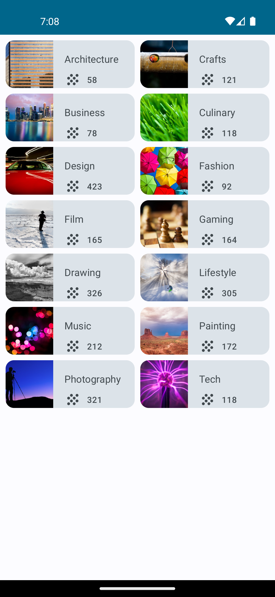
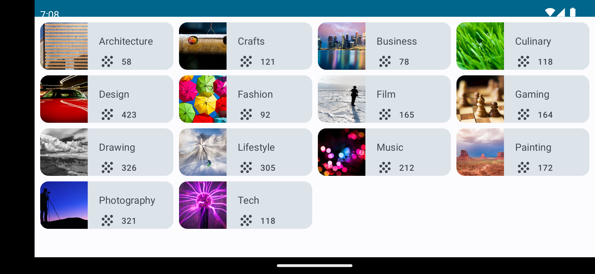

# Grid

Project of the Basid Android with Compose course, 
section Unit 3 Displays Lists and Use Material Design 
Pathway 2 Build a Scrollable list
4 Practice: Build a Grid

https://developer.android.com/courses/pathways/android-basics-compose-unit-3-pathway-2?authuser=0#codelab-https://developer.android.com/codelabs/basic-android-kotlin-compose-practice-grid

